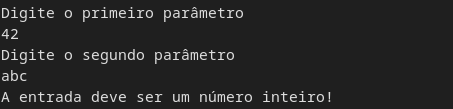
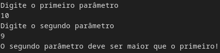
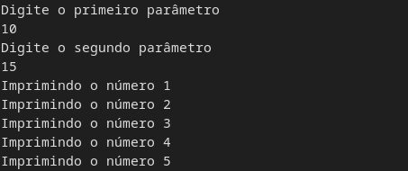

# 🔃️ Desafio Controle de Fluxo 🔄️

O desafio consiste em receber duas entradas do usuário, via Scanner.
As entradas devem ser numéricas e a primeira deve ser maior que a segunda.
Devem ser tratadas as exceções, como entrada inválida(texto, número não inteiro) e se a segunda entrada é maior que a primeira.

## Telas de exemplo:

Entrada inválida

Entrada inválida

Execução normal