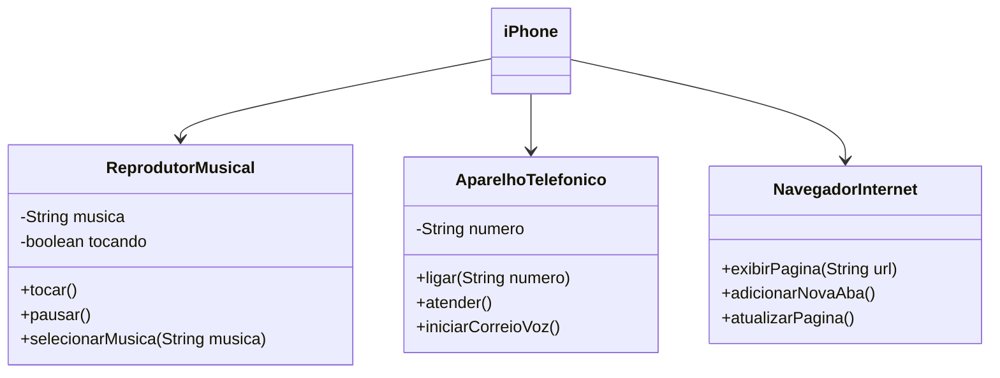
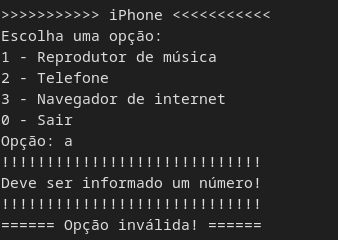
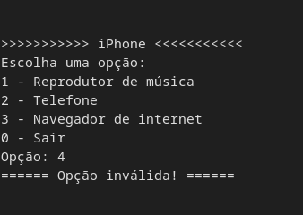
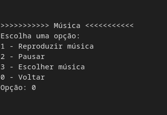
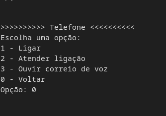
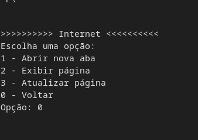

# 📱️ Desafio POO 📲️

Modelagem e Diagramação de um Componente iPhone, seguindo instruções do [desafio POO](https://github.com/digitalinnovationone/trilha-java-basico/tree/main/desafios/poo) da [DIO](https://web.dio.me).

## Modelagem UML

## Telas de exemplo:

